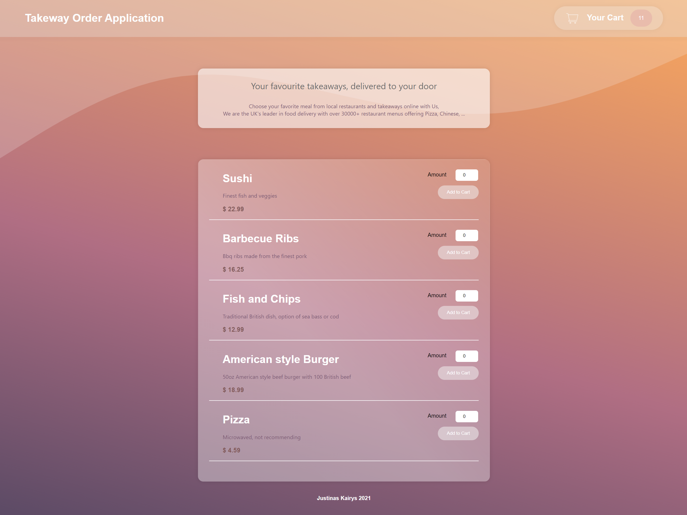
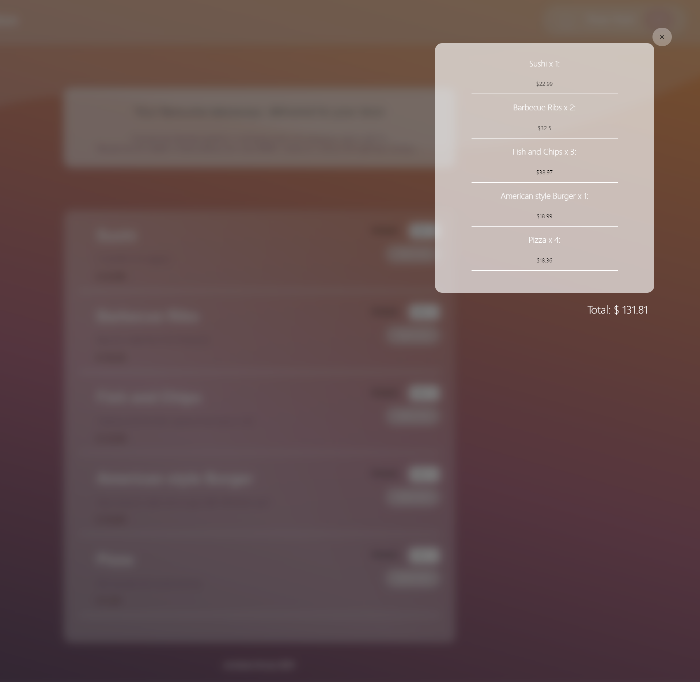

React application food ordering application

## Community coders, please commit

Feel free to add extra functions or improvements, This helps me to more familiarise with source control and open source project managing

## Running instructions

* copy project to your directory ( git clone https://github.com/ibnzUK/React_Food_Ordering )
* navigate to _React_Food_Ordering_ project directory
* make sure you have node.js installed on your machine
* install project packages (npm install)
* start project (npm run start)
